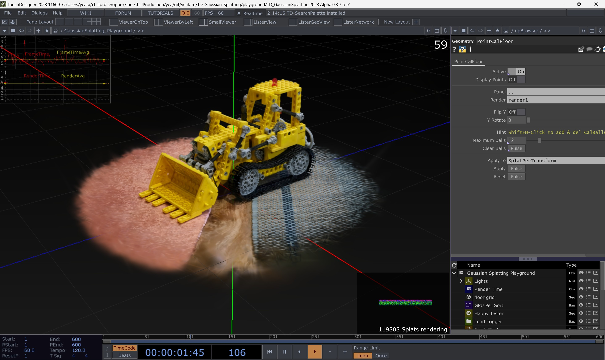
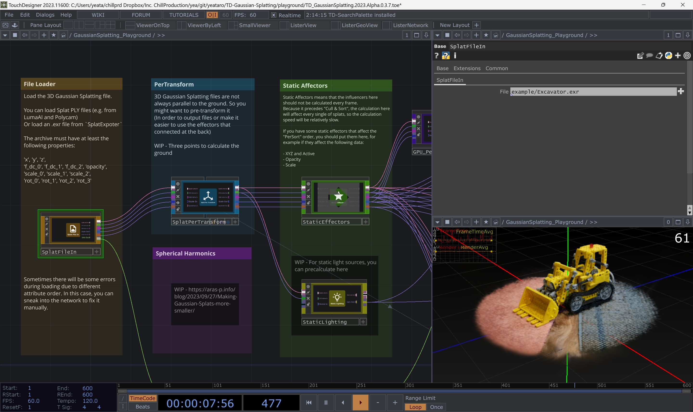

# Touchdesigner 3D Gaussian Splatting Toolkits

`This repository is switch to public for writing the wiki, please wait for the documentation to be completed.`

Touchdesigner implementation of a 3D gaussian rasterizer based on the paper : [3D Gaussian Splatting for Real-Time Radiance Field Rendering](https://repo-sam.inria.fr/fungraph/3d-gaussian-splatting/).

*The performance of the 2023 version project is significantly faster than the 2022 version

You can take a look at the things in the `/playground` first. There are demos of all current functions.

---

## Next steps

1. Change the objects instead of splats to triangles or dots (Less information, more artistic appearance)
2. Distorsions in space - Noise distorsions that we can trigger to modify XYZ of the pointcloud (On kicks for example)
3. Switch between pointclouds (Preload the next GS so we fade from one to the next)
4. Camera movements of space (Diferent positions to archive Ryoichi dinamism)
5. Switch opacity of pointclouds (Another variable to map to music)

## References and inspiration

- RYOICHI KUROKAWA
https://www.youtube.com/watch?v=AIX80WZSDgU
https://www.instagram.com/p/C1Zt-y4t_vf/?img_index=1
https://www.instagram.com/p/C6jJcjmt44k/
https://www.instagram.com/p/Cx-sj4sN-7L/

- MANTISSA
https://www.youtube.com/watch?v=eUL6jDovuZE

- OTHERS
https://www.youtube.com/watch?v=k45SibMyUCI

## Interesting tutorials

- https://www.youtube.com/watch?v=FJt2-SSMT0w&t=113s
- https://www.youtube.com/watch?v=dF0sj_R7DJY&t=109s

